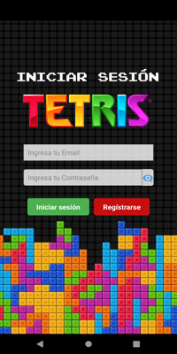
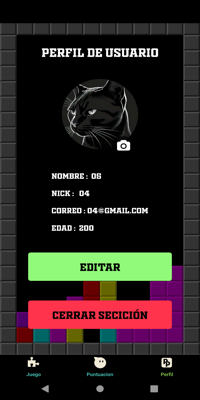
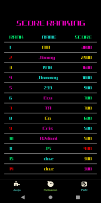

<h1 align="center">Tetris Game 🎮</h1>
<h3 align="center">Aplicación móvil para jugar Tetris, registrar puntuaciones y gestionar tu perfil. 🚀</h3>

<p align="center">
  
  
</p>

---

<h2 align="center">📱 Funcionalidades</h2>
<ul>
  <li>🕹️ <strong>Juega Tetris:</strong> Disfruta del clásico juego de Tetris directamente desde tu dispositivo móvil.</li>
  <li>📊 <strong>Ranking de puntuaciones:</strong> Revisa las mejores puntuaciones de los jugadores registrados.</li>
  <li>👤 <strong>Perfil de usuario:</strong> Gestiona tu información personal y edita tus datos fácilmente.</li>
</ul>

---

<h2 align="center">⚙️ Tecnologías Utilizadas</h2>
<p align="center">
  
  
  
</p>

---

<h2 align="center">🚀 Instalación</h2>

1. Clona el repositorio:
   ```bash
   git clone https://github.com/FrVillaI/app-juego-tetris.git

2. Instala las dependencias: 
    ```bash
    npm install

3. Configura Firebase:
    - Crea un proyecto en Firebase.
    - Habilita Authentication (correo electrónico/contraseña).
    - Configura una base de datos en tiempo real para almacenar las puntuaciones.

---

<h2 align="center">📸 Capturas de Pantalla</h2> 
    <p align="center"> 
         
         
         
         
    </p>
<h2 align="center">📬 Contacto</h2> 
<p align="center"> 
    <a href="https://www.linkedin.com/in/isaac-villacis-200609334/" target="_blank"> 
         
    </a> 
    <a href="mailto:isaacrvillacis@gmail.com" target="_blank"> 
         
    </a> 
</p> 
